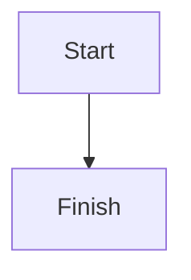

Blogin parses math and Mermaid diagrams into markup that a client-side renderer
turns into equations and graphics. The build stays pure and static; the rendering
happens in the browser.

## Math

Write inline math between single dollars and display math between double dollars,
or in a fenced `math` block:

````
The identity $e^{i\pi} + 1 = 0$ is inline.

$$\int_0^1 x^2 \, dx = \tfrac{1}{3}$$

```math
\sum_{n=1}^{\infty} \frac{1}{n^2} = \frac{\pi^2}{6}
```
````

Inline math becomes `<span class="math math-inline">`, display math a
`math-display` span, and a fenced block a `math-display` div. A dollar sign in
prose is left alone: `$5` and `$10` are not treated as math, because an opening
`$` followed by a space or digit does not start an expression.

## Diagrams

Put a diagram in a fenced `mermaid` block:

````

````

It renders to `<pre class="mermaid">` with the diagram source preserved.

## Wiring the renderers

Add the client libraries to `base.haml`. For math, load KaTeX and render the
`.math` elements:

```html
<link rel="stylesheet" href="https://cdn.jsdelivr.net/npm/katex/dist/katex.min.css">
<script defer src="https://cdn.jsdelivr.net/npm/katex/dist/katex.min.js"></script>
<script defer>
  addEventListener('DOMContentLoaded', () => {
    document.querySelectorAll('.math').forEach(el =>
      katex.render(el.textContent, el, { displayMode: el.classList.contains('math-display') }));
  });
</script>
```

For diagrams, load Mermaid and let it start on the `.mermaid` blocks:

```html
<script type="module">
  import mermaid from 'https://cdn.jsdelivr.net/npm/mermaid/dist/mermaid.esm.min.mjs';
  mermaid.initialize({ startOnLoad: true });
</script>
```
